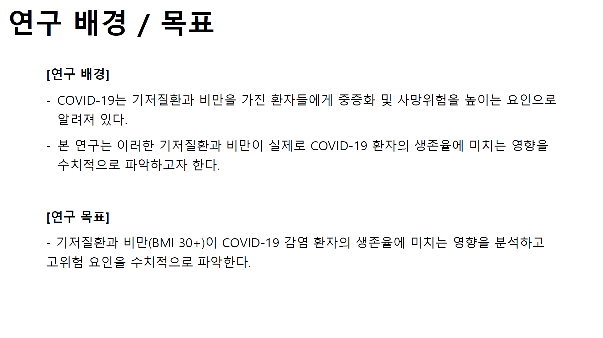
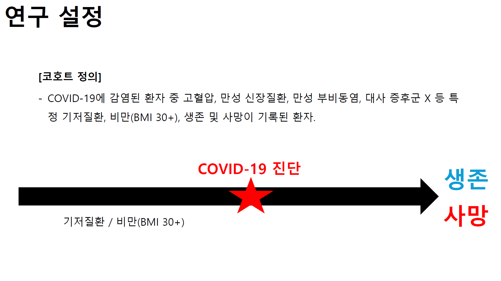

<div align="center">

# COVID-19 Survival Analysis

<p>
  <a href="./README.md">한국어</a> · <strong>English</strong>
</p>

**A synthetic clinical data project comparing survival distributions across obesity and comorbidity groups and examining adjusted associations with mortality risk**


<br/>


<sub>
This graphic summarizes the analysis workflow. The original analysis results are shown below using figures from the presentation.
</sub>

<br/><br/>

<a href="./materials/2024-compass-hackathon-poster.pdf">
  
</a>
<a href="./materials/2024-compass-hackathon-presentation.pdf">
  
</a>
<a href="./materials/2024-compass-hackathon-award.pdf">
  
</a>
<a href="https://www.veritas-a.com/news/articleView.html?idxno=528804">
  
</a>

</div>

---

## 🧭 Study Overview

This project examined how obesity and selected comorbidities were associated with survival distributions among patients with COVID-19. Survival curves were compared for hypertension, chronic kidney disease, chronic sinusitis, and metabolic syndrome X. A Cox proportional hazards model was then used to assess which variables remained associated with mortality risk when age, sex, race, obesity status, and comorbidities were considered together.

The univariable survival analyses were used to identify differences between groups, while the Cox model evaluated whether those associations persisted after multivariable adjustment.

<p align="center">
  
</p>

---

## ❓ Research Questions

1. After stratifying patients by obesity status, do survival distributions differ according to the presence of each comorbidity?
2. Which variables remain associated with mortality risk when age, sex, race, obesity status, and multiple comorbidities are considered together?

---

## 👥 Data and Cohort

The analysis used synthetic clinical data provided through the COMPASS platform during the hackathon. The analytic cohort included patients with recorded COVID-19 infection and survival status, along with demographic, obesity, and comorbidity information.

The main variables were:

- **Demographics:** age, sex, and race
- **Obesity:** BMI 30 or higher
- **Comorbidities:** hypertension, chronic kidney disease, chronic sinusitis, and metabolic syndrome X
- **Outcome:** survival or death status

<p align="center">
  
</p>

---

## 🧪 Methods

Patients were first stratified by obesity status. Within each stratum, Kaplan–Meier survival curves were compared according to the presence or absence of each comorbidity. This analysis was used to evaluate differences in survival distributions between groups.

A Cox proportional hazards model was then fitted to determine whether the observed associations remained after accounting for multiple variables. The model included age, sex, race, obesity status, and the four comorbidities.

```text
Patients with COVID-19
        ↓
Stratification by obesity status
        ↓
Kaplan–Meier comparison by
presence or absence of each comorbidity
        ↓
Cox proportional hazards model including
age, sex, race, obesity status, and comorbidities
```

---

## 📊 Results

### Kaplan–Meier Survival Analysis

Log-rank tests indicated statistically significant differences in all four comorbidity analyses. The figures below are the Kaplan–Meier survival curves presented in the original project presentation.

<table>
  <tr>
    <td width="50%" align="center">
      
      <br/>
      <sub>Chronic Kidney Disease</sub>
    </td>
    <td width="50%" align="center">
      
      <br/>
      <sub>Chronic Sinusitis</sub>
    </td>
  </tr>
  <tr>
    <td width="50%" align="center">
      
      <br/>
      <sub>Hypertension</sub>
    </td>
    <td width="50%" align="center">
      
      <br/>
      <sub>Metabolic Syndrome X</sub>
    </td>
  </tr>
</table>

<details>
<summary><strong>View log-rank test results</strong></summary>

| Comorbidity | p-value |
|:---|---:|
| Chronic kidney disease | 2.904986e-13 |
| Chronic sinusitis | 1.474284e-09 |
| Hypertension | 2.411282e-37 |
| Metabolic syndrome X | 3.806251e-17 |

</details>

### Cox Proportional Hazards Model

After age, sex, race, obesity status, and the four comorbidities were considered together, **age and hypertension were significantly associated with mortality risk.** Obesity status was not statistically significant after the other variables were included in the model.

<p align="center">
  
</p>

<details>
<summary><strong>View key Cox model estimates</strong></summary>

| Variable | Hazard Ratio | 95% CI | p-value |
|:---|---:|---:|---:|
| Hypertension | 5.481 | 3.089–9.725 | 6.06e-09 |
| Age, per one-year increase | 1.066 | 1.053–1.079 | 4.58e-26 |
| Obesity status | 1.093 | 0.674–1.773 | 0.719 |

</details>

---

## 🔍 Interpretation

The Kaplan–Meier analyses showed clear differences between survival curves, whereas obesity status did not remain statistically significant in the Cox model after multivariable adjustment.

This distinction shows why separation between unadjusted survival curves and associations that persist after accounting for age and other comorbidities should be interpreted differently. Rather than treating the initial group differences as a final conclusion, the project compared the univariable and multivariable results.

The analysis used synthetic clinical data, and the findings are described within the scope of observed statistical associations.

---

## 📎 Project Materials

| Material | Link | Description |
|:---|:---|:---|
| Poster | [2024 COMPASS Hackathon Poster](./materials/2024-compass-hackathon-poster.pdf) | Research questions, cohort, methods, and key results |
| Presentation | [2024 COMPASS Hackathon Presentation](./materials/2024-compass-hackathon-presentation.pdf) | Kaplan–Meier and Cox model results |
| Award | [Encouragement Award Certificate](./materials/2024-compass-hackathon-award.pdf) | Award received by Team `Insight_'AI'_chemists` |
| Event coverage | [Veritas Alpha article](https://www.veritas-a.com/news/articleView.html?idxno=528804) | Coverage of the 2024 COMPASS Hackathon |

---

## 🤝 Team and Roles

| Name | Role |
|:---|:---|
| **Gibum Choi (최기범)** | Research question and analysis direction, cohort construction, statistical analysis, interpretation, and presentation |
| **한만규** | Team project contributor |

<div align="center">

**Team `Insight_'AI'_chemists` · Encouragement Award, 2024 COMPASS Hackathon**

</div>

---

## © Use of Materials

No open-source or Creative Commons license is granted for this repository.

Unless otherwise stated, the **README text and original overview diagrams or analysis figures authored by Gibum Choi** are made available for academic portfolio and review purposes. Please obtain prior permission before reusing, modifying, or redistributing these materials.

The source data are not included and remain subject to the terms of the data provider. Jointly authored materials, award documents, institutional logos, news coverage, and other third-party content are excluded and remain subject to the rights and terms of their respective owners or providers.
