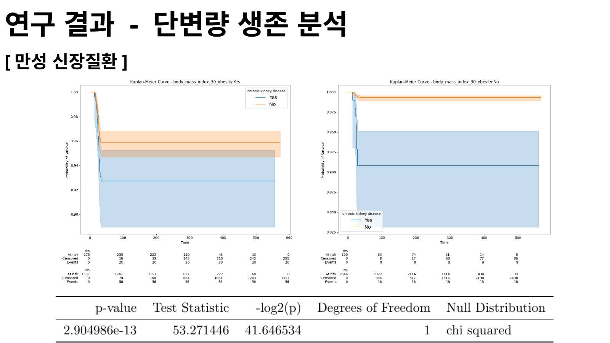
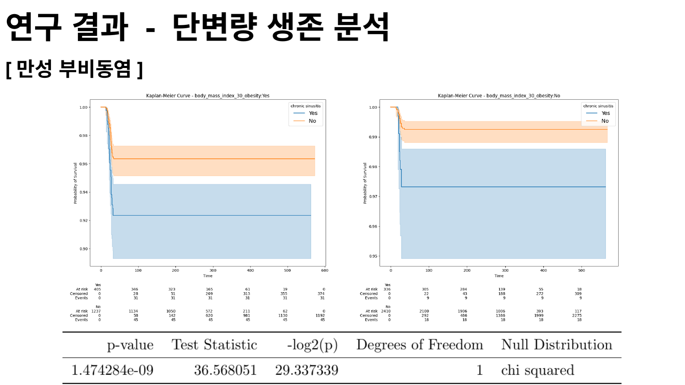
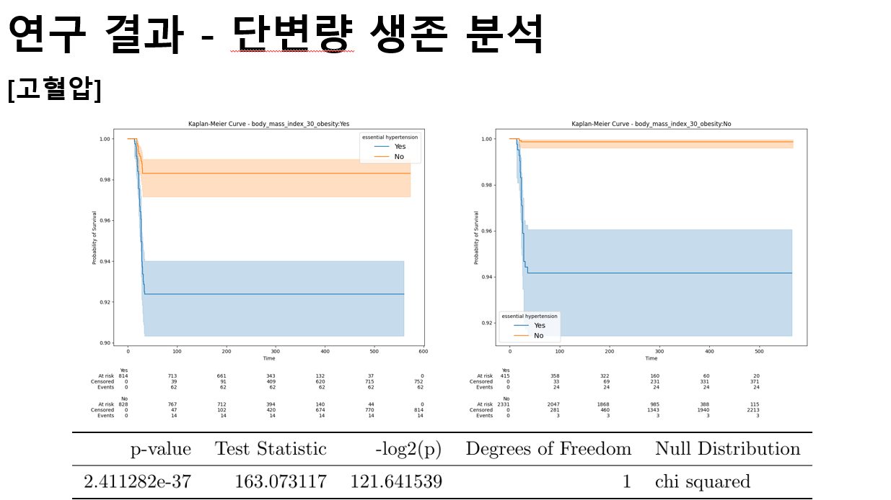
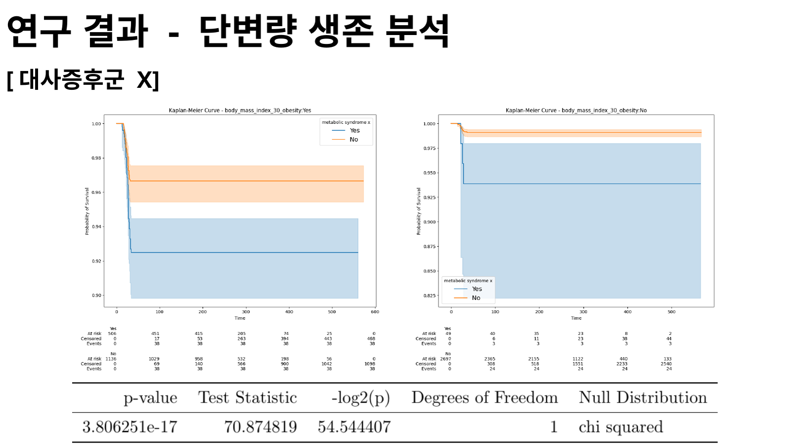
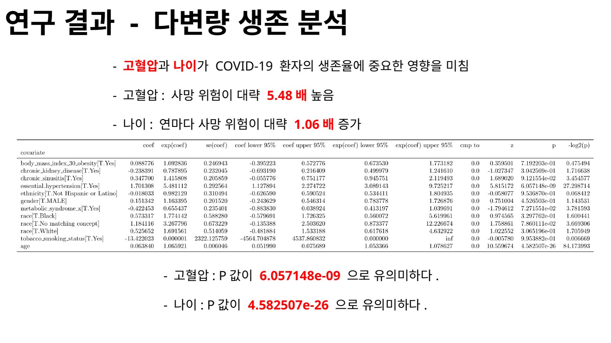

<div align="center">

# COVID-19 생존율 분석

비만 여부로 층화한 환자군에서 기저질환 유무에 따른 생존곡선을 비교하고,<br/>
다변량 모형으로 사망위험 관련 요인을 확인한 합성 임상데이터 분석입니다.


<br/>


<sub>
분석 구조를 요약한 개요 도식입니다. 이미지 속 생존곡선은 설명용이며,<br/>
당시 발표자료의 실제 결과 이미지는 아래에 별도로 제시합니다.
</sub>

<br/><br/>

<a href="./materials/2024-compass-hackathon-poster.pdf">
  
</a>
<a href="./materials/2024-compass-hackathon-presentation.pdf">
  
</a>
<a href="./materials/2024-compass-hackathon-award.pdf">
  
</a>
<a href="https://www.veritas-a.com/news/articleView.html?idxno=528804">
  
</a>

<br/><br/>

<sub>
2024년 COMPASS 해커톤 당시 제작한 포스터와 발표자료를 바탕으로 정리했습니다.<br/>
원본 데이터와 당시 분석 코드는 포함하지 않습니다.
</sub>

</div>

---

## 연구 개요

COVID-19 감염 환자에서 비만과 기저질환이 생존 양상과 어떤 관련을 보이는지 분석했습니다. 분석에는 해커톤 당시 COMPASS 플랫폼을 통해 제공된 합성 임상데이터를 사용했습니다.

비만 여부로 환자군을 먼저 층화한 뒤, 각 층에서 네 가지 기저질환의 유무에 따른 Kaplan–Meier 생존곡선을 비교했습니다. 이후 인구통계학적 변수, 비만 여부와 기저질환 등을 함께 포함한 Cox 비례위험모형을 적용해, 다른 변수들을 고려한 뒤에도 사망위험과 관련성이 유지되는 요인을 확인했습니다.

```text
COVID-19 감염 환자
        ↓
비만 여부로 환자군 층화
        ↓
각 층에서 기저질환 유무별
Kaplan–Meier 생존곡선 비교
        ↓
Cox 비례위험모형을 이용한 보정 분석
```

---

## 연구 질문

1. 비만 여부로 나눈 환자군에서 각 기저질환 유무에 따라 생존곡선이 달라지는지 확인했습니다.
2. 여러 변수를 함께 고려한 뒤에도 사망위험과 관련되는 요인이 남는지 확인했습니다.

---

## 데이터와 코호트

COVID-19 감염과 생존·사망 상태, 비만 여부 및 기저질환 정보가 기록된 환자를 분석 대상으로 설정했습니다.

분석에 포함한 기저질환은 다음과 같습니다.

- 만성 신장질환
- 만성 부비동염
- 고혈압
- 대사증후군 X

주요 분석 변수로는 연령, 성별, 인종, BMI 30 이상 비만 여부, 기저질환 기록과 생존·사망 상태를 사용했습니다.

---

## 분석 방법

### Kaplan–Meier 생존분석

비만 여부로 환자군을 층화한 뒤, 각 층에서 해당 기저질환의 유무에 따른 Kaplan–Meier 생존곡선을 비교했습니다. 집단 간 생존분포 차이는 log-rank 검정을 통해 확인했습니다.

Kaplan–Meier 분석은 생존곡선의 차이를 시각적으로 확인하는 데 유용하지만, 곡선이 분리됐다는 사실만으로 특정 변수가 독립적으로 사망위험과 관련된다고 판단하기는 어렵습니다. 연령과 다른 기저질환 등의 영향이 함께 반영될 수 있기 때문입니다.

### Cox 비례위험모형

단변량 비교에서 관찰된 차이가 다른 변수들을 고려한 뒤에도 유지되는지 확인하기 위해 Cox 비례위험모형을 적용했습니다. 모형에는 인구통계학적 변수, 비만 여부와 네 가지 기저질환 등을 함께 포함했습니다.

---

## 분석 결과

### Kaplan–Meier 생존분석

당시 발표에서는 네 기저질환에 대한 Kaplan–Meier 비교 모두에서 통계적으로 유의한 생존곡선 차이를 보고했습니다.

<table>
  <tr>
    <td width="50%" align="center">
      
      <br/><sub>만성 신장질환</sub>
    </td>
    <td width="50%" align="center">
      
      <br/><sub>만성 부비동염</sub>
    </td>
  </tr>
  <tr>
    <td width="50%" align="center">
      
      <br/><sub>고혈압</sub>
    </td>
    <td width="50%" align="center">
      
      <br/><sub>대사증후군 X</sub>
    </td>
  </tr>
</table>

<details>
<summary><strong>포스터에 보고된 log-rank p-value 보기</strong></summary>

<br/>

| 기저질환 | p-value |
|:---|---:|
| 만성 신장질환 | `2.904986e-13` |
| 만성 부비동염 | `1.474284e-09` |
| 고혈압 | `2.411282e-37` |
| 대사증후군 X | `3.806251e-17` |

</details>

### Cox 비례위험모형

여러 변수를 함께 고려한 결과, 연령과 고혈압은 사망위험과 통계적으로 유의한 관련성을 보였습니다. 반면 비만 여부는 다른 변수들을 함께 고려한 뒤에는 유의한 변수로 유지되지 않았습니다.

<p align="center">
  
</p>

<details>
<summary><strong>주요 보고 수치 보기</strong></summary>

<br/>

| 변수 | Hazard Ratio | 95% CI | p-value |
|:---|---:|---:|---:|
| 고혈압 | `5.481112` | `3.089143–9.725217` | `6.057148e-09` |
| 연령 1년 증가 | `1.065921` | `1.053366–1.078627` | `4.582507e-26` |
| 비만 여부 | `1.092836` | `0.673530–1.773182` | `0.7192203` |

</details>

---

## 결과 해석

Kaplan–Meier 분석에서는 집단 간 생존곡선 차이가 분명하게 나타났지만, 다변량 Cox 모형에서는 비만의 유의성이 유지되지 않았습니다.

따라서 생존곡선에서 관찰된 집단 차이와 여러 공변량을 고려한 뒤에도 유지되는 관련성은 구분해 해석할 필요가 있습니다. 이 프로젝트에서는 단변량 결과를 그대로 결론으로 받아들이지 않고, 연령과 다른 기저질환 등을 함께 고려한 뒤 결과를 다시 확인했습니다.

---

## 한계와 공개 범위

- 합성 임상데이터를 사용했으므로 결과를 실제 환자집단에 그대로 일반화하기 어렵습니다.
- 현재 원본 데이터와 분석 코드가 남아 있지 않아 전처리 과정과 모형 가정을 다시 검토하거나 결과를 재현하지 못했습니다.
- 관찰된 결과는 통계적 관련성을 보여주며 인과효과를 의미하지 않습니다.

이 저장소에는 프로젝트 개요 도식, 발표자료에서 추출한 집계 결과 이미지, 포스터, 발표자료와 상장을 포함합니다.

---

## 프로젝트 자료

| 자료 | 링크 |
|:---|:---|
| 포스터 | [2024 COMPASS 해커톤 포스터](./materials/2024-compass-hackathon-poster.pdf) |
| 발표자료 | [2024 COMPASS 해커톤 발표자료](./materials/2024-compass-hackathon-presentation.pdf) |
| 상장 | [2024 COMPASS 해커톤 장려상](./materials/2024-compass-hackathon-award.pdf) |
| 행사 보도 | [베리타스알파 — 「2024 COMPASS 해커톤」 성료](https://www.veritas-a.com/news/articleView.html?idxno=528804) |

---

## 팀과 역할

| 이름 | 역할 |
|:---|:---|
| 최기범 | 연구 질문 및 분석 방향 설정, 코호트 구성, 통계분석, 결과 해석과 발표 |
| 한만규 | 프로젝트 공동 수행 |

**Insight_'AI'_chemists** 팀으로 참여해 장려상을 수상했습니다.
